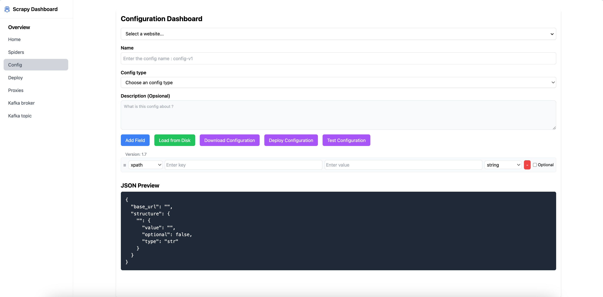
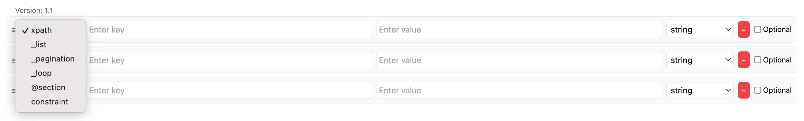
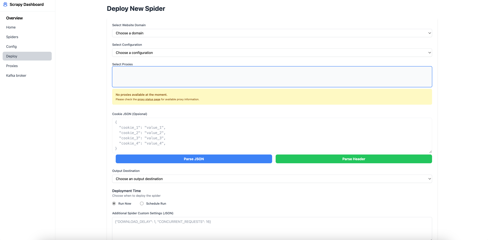
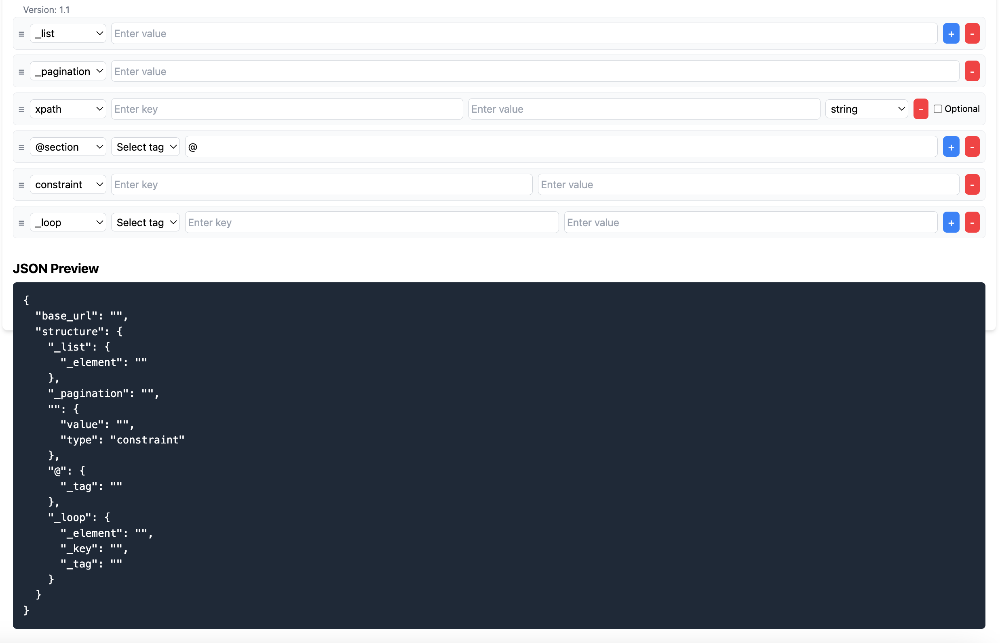

# How To Use Config Maker 🚀

## Dashboard Config Maker

### Initial Steps
Gunakan antarmuka aplikasi untuk membuat konfigurasi XPath yang akan digunakan untuk scraping. Setiap konfigurasi memungkinkan Anda mendefinisikan elemen-elemen spesifik yang akan diekstraksi dari halaman web.

!> **Penting:** Scrapy General Engine saat ini hanya mendukung `XPath 1.0` kunjungi [Dokumentasi XPath 1.0](https://www.w3.org/TR/1999/REC-XPath-19991116/).

### User Interface
Berikut adalah tampilan antarmuka untuk membuat konfigurasi pertama Anda:




### Button Dashboard
Pada dashboard **Config Maker**, terdapat beberapa tombol `(button)` yang dapat digunakan untuk melakukan berbagai fungsi terkait pengelolaan konfigurasi. Berikut adalah penjelasan dari setiap tombol dan fungsinya:


---

#### add field
Tombol **Add Field** digunakan untuk menambahkan field baru ke dalam konfigurasi XPath. Ini memungkinkan pengguna untuk menyesuaikan konfigurasi sesuai kebutuhan scraping.

**Ilustrasi**:



**Fungsi Utama**:

- Menambahkan elemen atau atribut baru ke dalam struktur konfigurasi.
- Contoh penggunaan: Menambahkan XPath baru untuk mengambil data dari elemen yang baru ditemukan pada halaman web.

---

#### load from disk

Tombol **Load from Disk** memungkinkan pengguna untuk mengimpor konfigurasi yang sudah ada dari file lokal. Dengan fitur ini, pengguna tidak perlu membuat konfigurasi dari awal setiap kali ingin menggunakan konfigurasi lama.

**Ilustrasi**:


**Fungsi Utama**:

- Mengunggah file konfigurasi dalam format JSON yang telah disimpan sebelumnya.
- Membantu pengguna mengelola dan memuat konfigurasi dengan cepat tanpa perlu input manual.

---

#### download configuration

Tombol ini digunakan untuk mengunduh konfigurasi yang sudah dibuat atau dimodifikasi ke dalam file lokal. Dengan fitur ini, pengguna dapat menyimpan hasil konfigurasi untuk digunakan di lain waktu atau sebagai cadangan.

**Fungsi Utama**:
- Menyimpan konfigurasi dalam format JSON ke perangkat pengguna.
- Memudahkan berbagi konfigurasi dengan tim lain.

---

#### deploy configuration

Tombol **Deploy Configuration** berfungsi untuk menerapkan konfigurasi yang telah dibuat ke dalam aplikasi atau sistem yang menggunakan konfigurasi tersebut. Fitur ini memastikan bahwa konfigurasi siap digunakan untuk proses scraping.

**Ilustrasi**:



**Fungsi Utama**:

- Mengintegrasikan konfigurasi dengan aplikasi scraping.
- Memastikan konfigurasi diterapkan secara langsung di lingkungan produksi atau pengujian.

---

#### test configuration

Tombol Test Configuration memungkinkan pengguna untuk menguji konfigurasi XPath yang telah dibuat. Dengan fitur ini, pengguna dapat memastikan bahwa konfigurasi bekerja sesuai harapan sebelum diterapkan.

**Ilustrasi**:


**Fungsi Utama**:

- Mengecek apakah XPath yang ditentukan benar-benar dapat mengambil data yang diinginkan dari halaman web.
- Memberikan umpan balik kepada pengguna jika terdapat kesalahan pada konfigurasi.

?> **Tips:** Gunakan struktur folder yang konsisten untuk mengelola file konfigurasi XPath Anda.

---

##  Template XPath JSON



?> **Tips:** Konfigurasi scraping didefinisikan dalam format JSON. Template ini membantu Anda menentukan elemen-elemen yang ingin diambil.


### Structure Configuration

Setiap konfigurasi scraping didefinisikan dalam format JSON seperti berikut:

```terminal
{
  "base_url": "http://example.com",
  "structure": {
    "_list": {
      "_element": "XPath untuk list elemen"
    },
    "_pagination": "XPath untuk tombol next page",
    "key_XPath_constraint": {
      "value": "XPath untuk mengambil nilai",
      "type": "string",
      "optional": false
    },
    "@hanya_place_holder_untuk_element_lain": {
      "_tag": ""
    },
    "_loop": {
      "_element": "XPath untuk elemen yang akan di-loop",
      "_key": "kunci untuk elemen",
      "_tag": "tag untuk elemen"
    }
  }
}
```

!> **Penting:** Scrapy General Engine saat ini hanya mendukung `XPath 1.0` kunjungi [Dokumentasi XPath 1.0](https://www.w3.org/TR/1999/REC-XPath-19991116/).

###  Details Fields Structure

#### base url

Digunakan untuk URL dasar dari situs web yang akan discraping.

```terminal
"base_url": "http://bzzzzsvqcrqtki6uym6itiixfhni37ybtt7mkbjyxn2pgllzxf2qgyd.onion"
```

---

#### list

Mendefinisikan XPath untuk elemen daftar, seperti daftar produk.

```terminal
"_list": {
  "_element": "//div[@class='product-list']/a/@href"
}
```

!> **Penting:** Scrapy General Engine saat ini hanya mendukung `XPath 1.0` kunjungi [Dokumentasi XPath 1.0](https://www.w3.org/TR/1999/REC-XPath-19991116/).

---

#### pagination

XPath untuk tombol next page yang mengarah ke halaman berikutnya.

```terminal
"_pagination": "//a[@class='next-page']/@href"
```

!> **Penting:** Scrapy General Engine saat ini hanya mendukung `XPath 1.0` kunjungi [Dokumentasi XPath 1.0](https://www.w3.org/TR/1999/REC-XPath-19991116/).

---

#### constraint

Field untuk menentukan nilai tertentu menggunakan XPath dengan opsi tipe dan opsional.

```terminal
"source": {
  "value": "deepweb",
  "type": "constraint"
},
```

!> **Penting:** Scrapy General Engine saat ini hanya mendukung `XPath 1.0` kunjungi [Dokumentasi XPath 1.0](https://www.w3.org/TR/1999/REC-XPath-19991116/).

---

#### placeholder

Section placeholder untuk elemen lain yang tidak termasuk dalam kategori utama dengan menggunakan simbols `@`.

```terminal
"@thread": {
  "_tag": "global"
}
```

!> **Penting:** Scrapy General Engine saat ini hanya mendukung `XPath 1.0` kunjungi [Dokumentasi XPath 1.0](https://www.w3.org/TR/1999/REC-XPath-19991116/).

---

#### loop

XPath untuk elemen yang perlu diulang, seperti komentar atau ulasan.

```terminal
"_loop": {
  "_element": "//div[@class='comments']/div",
  "_key": "comment",
  "_tag": "root"
}
```

!> **Penting:** Scrapy General Engine saat ini hanya mendukung `XPath 1.0` kunjungi [Dokumentasi XPath 1.0](https://www.w3.org/TR/1999/REC-XPath-19991116/).

---

### Optional, Tag dan Type

#### type

 Tipe data mendefinisikan nilai yang diambil oleh XPath.

```terminal
"type": "[string, integer, list, timestamp]"
```

?> **Note:** Type memiliki 4 value yaitu: `string`, `integer`, `list` dan `timestamp`

---

#### optional

Menentukan apakah sebuah field bersifat opsional.

```terminal
"optional": [true, false]
```

?> **Note:** Optional memiliki 2 value boolean yaitu: `true` dan `false`

---

#### tag

Tag ini akan digunakan untuk menentukan data yang akan dimapping kedalam tag tersebut

```terminal
"_tag": "[root, global, parent]"
```
?> **Note:** Tag memiliki 3 value yaitu: `root`, `global` dan `parent`

---

# JSON Preview

Bagian ini memberikan tampilan hasil konfigurasi dalam format JSON. Format ini memudahkan integrasi dengan aplikasi.

```json
{
  "base_url": "http://example.com",
  "structure": {
    "_list": {
      "_element": "//div[@class='product-list']/a/@href"
    },
    "_pagination": "//a[@class='next-page']/@href",
    "source": {
      "value": "deepweb",
      "type": "string",
      "optional": false
    },
    "@": {
      "_tag": "parent"
    },
    "_loop": {
      "_element": "//div[@class='comments']/div",
      "_key": "comment",
      "_tag": "root"
    }
  }
}
```

## sample config

```json
{
  "base_url": "http://bbzzzsvqcrqtki6umym6itiixfhni37ybtt7mkbjyxn2pgllzxf2qgyd.onion",
  "structure": {
    "@landing_page": {
      "_tag": "",
      "_list": {
        "_element": "//h3[@class='node-title']//a/@href",
        "@thread_topic": {
          "_tag": "",
          "_pagination": "(//a[contains(@class, 'pageNav-jump pageNav-jump--next')]/@href)[1]",
          "_list": {
            "_element": "//div[contains(@class, 'structItem--thread')]//div[@class='structItem-title']/a/@href",
            "_pagination": "(//a[contains(@class, 'pageNav-jump pageNav-jump--next')]/@href)[1]",
            "@thread": {
              "_tag": "global",
              "source": {
                "value": "deepweb",
                "type": "constraint"
              },
              "name": {
                "value": "//h1[@class='p-title-value']/text()",
                "optional": false,
                "type": "str"
              },
              "timestamp": {
                "value": "//div[@class='p-body-header']//time/@title",
                "optional": false,
                "type": "timestamp"
              },
              "content": {
                "value": "string((//article[contains(@class, 'js-post ')])[1]//div[@class='bbWrapper'])",
                "optional": false,
                "type": "str"
              },
              "username": {
                "value": "string((//article[contains(@class, 'js-post ')])[1]//a[@class='username '])",
                "optional": true,
                "type": "str"
              },
              "media_url": {
                "value": "(//article[contains(@class, 'js-post ')])[1]//div[@class='bbWrapper']//img/@src | (//article[contains(@class, 'js-post ')])[1]//div[@class='bbWrapper']//video/source/@src ",
                "optional": false,
                "type": "list"
              },
              "_loop": {
                "_element": "(//article[not(ancestor::div[contains(@class, 'js-tprReplyMessageContainer')]) and not(contains(@class, 'message-body'))])[position()>1]",
                "_key": "thread_reply",
                "_tag": "parent",
                "id": {
                  "value": "(./@data-content)[1]",
                  "optional": false,
                  "type": "str"
                },
                "username": {
                  "value": "(.//a[contains(@class, 'username')]/text() | .//a[contains(@class, 'username')]/span/text())[1]",
                  "optional": false,
                  "type": "str"
                },
                "content": {
                  "value": "string((.//div[@class='bbWrapper'])[1])",
                  "optional": false,
                  "type": "str"
                },
                "timestamp": {
                  "value": "(.//div[@class='meta-date']/@title)[1]",
                  "optional": false,
                  "type": "timestamp"
                },
                "media_url": {
                  "value": "(.//img/@src | .//video/source/@src)[1]",
                  "optional": true,
                  "type": "list"
                },
                "_loop": {
                  "_element": ".//div[@class='message-inner']//article[contains(@class, 'message message--post')]",
                  "_key": "thread_comment_reply",
                  "_tag": "root",
                  "id": {
                    "value": "./@data-content",
                    "optional": false,
                    "type": "str"
                  },
                  "username": {
                    "value": "(.//a[contains(@class, 'username')]/text() | .//a[contains(@class, 'username')]/span/text())[1]",
                    "optional": false,
                    "type": "str"
                  },
                  "content": {
                    "value": "string(.//div[@class='bbWrapper'])",
                    "optional": false,
                    "type": "str"
                  },
                  "timestamp": {
                    "value": ".//div[@class='meta-date']/@title",
                    "optional": false,
                    "type": "timestamp"
                  },
                  "media_url": {
                    "value": ".//img/@src | .//video/source/@src",
                    "optional": true,
                    "type": "list"
                  }
                }
              }
            }
          }
        }
      }
    }
  }
}
```

?> **Tips:** Jika ingin melihat `sample-config.json` lebih lanjut kunjungi [sample-config-repository](https://github.com/fossyy/general_spider/tree/mapping).
