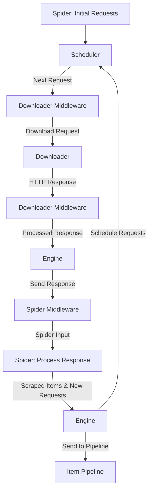

## Scrapy General Engine Documentation

  

  

  

  

  

  

  

  

# Overview
Scrapy adalah framework **web scraping** open-source yang digunakan untuk mengekstrak data dari website.
**Scrapy General Engine** bertanggung jawab untuk mengatur aliran data dari permintaan HTTP hingga hasil data yang diekstrak secara terstruktur.

Scrapy menggunakan **event-driven architecture** yang efisien dan scalable untuk menangani banyak permintaan dalam waktu singkat.

?> **Note:** Dokumentasi lengkap tentang `Framework Scrapy` kunjungi [Scrapy Documentation](https://docs.scrapy.org/en/latest/).

---

# Architecture Scrapy

Diagram berikut menunjukkan **gambaran umum arsitektur Scrapy** dengan komponen-komponennya serta garis besar aliran data yang terjadi di dalam sistem (ditunjukkan oleh **panah merah**).  
Penjelasan singkat mengenai komponen-komponen tersebut disertakan di bawah ini dengan tautan untuk informasi yang lebih rinci mengenai komponen tersebut.  
**Aliran data** juga dijelaskan di bagian berikut.

---

**Aliran Data**

Aliran data di Scrapy dikendalikan oleh **Scrapy Engine** dan berjalan seperti ini:

1. **Mesin** (Engine) mendapatkan **Permintaan awal** (*Initial Requests*) dari **Spider**.  
2. **Mesin** menjadwalkan Permintaan di **Scheduler** dan meminta Permintaan berikutnya untuk diproses.  
3. **Scheduler** mengembalikan **Permintaan berikutnya** ke Engine.  
4. **Mesin** mengirimkan Permintaan ke **Downloader**, melalui **Downloader Middleware** (`process_request()`).  
5. Setelah halaman berhasil diunduh:  
   - **Downloader** menghasilkan **Response** (halaman yang diunduh).  
   - **Response** dikirim kembali ke **Engine** melalui **Downloader Middleware** (`process_response()`).  
6. **Engine** menerima **Response** dari Downloader dan mengirimkannya ke **Spider**, melalui **Spider Middleware** (`process_spider_input()`).  
7. **Spider** memproses **Response** dan menghasilkan:  
   - **Item** yang telah di-*scrape* (data yang diekstrak).  
   - **Permintaan baru** (*New Requests*) untuk diproses.  
   Hasil ini dikirim kembali ke **Engine** melalui **Spider Middleware** (`process_spider_output()`).  
8. **Engine** melakukan dua hal:  
   - Mengirimkan **Item** yang telah diproses ke **Item Pipelines**.  
   - Mengirimkan **Permintaan baru** ke **Scheduler** untuk dijadwalkan kembali.  
9. **Engine** meminta **Permintaan berikutnya** ke Scheduler dan proses ini berulang dari langkah **3**.  

Proses ini terus berjalan hingga tidak ada lagi permintaan yang tersedia di **Scheduler**.

---

# Scrapy Engine Workflow

Langkah-Langkah Utama dalam Workflow Scrapy Engine:  
1. **Scheduler**  
   Scheduler menerima **permintaan (request)** dari Spider dan menyimpan request dalam antrean untuk dieksekusi.

2. **Downloader**  
   Downloader mengambil request yang dijadwalkan oleh Scheduler dan mengeksekusi permintaan tersebut untuk mengambil **HTTP Response** dari website.

3. **Spider**  
   Spider menerima **respon (response)** dari Downloader, lalu:
   - Mengekstrak data yang diinginkan menggunakan XPath atau CSS Selectors.
   - Menghasilkan **Item** (data yang diekstrak) dan permintaan tambahan.

4. **Item Pipeline**  
   Data yang diekstrak (Items) dikirim ke **Item Pipeline** untuk diproses, disimpan, atau diformat sesuai kebutuhan (CSV, JSON, Database, dll).

5. **Stats Collector**  
   Stats Collector mencatat statistik scraping seperti jumlah request, response berhasil, dan error.

---

# Scrapy Engine Components

| **Komponen**       | **Deskripsi**                                                                 |
|---------------------|------------------------------------------------------------------------------|
| **Engine**          | Komponen inti Scrapy yang mengatur aliran permintaan dan respon.             |
| **Scheduler**       | Bertanggung jawab menyimpan dan menjadwalkan request untuk dieksekusi.       |
| **Downloader**      | Menangani permintaan HTTP dan mengembalikan respon ke Spider.                |
| **Spider**          | Mengekstrak data dari respon dan menghasilkan request tambahan.              |
| **Item Pipeline**   | Memproses, memvalidasi, dan menyimpan data yang diekstrak.                   |
| **Stats Collector** | Mengumpulkan statistik scraping seperti request dan error.                   |

---

# Flowchart Scrapy

Untuk memahami lebih dalam alur kerja Scrapy, berikut langkah-langkah yang dijelaskan secara visual:  

