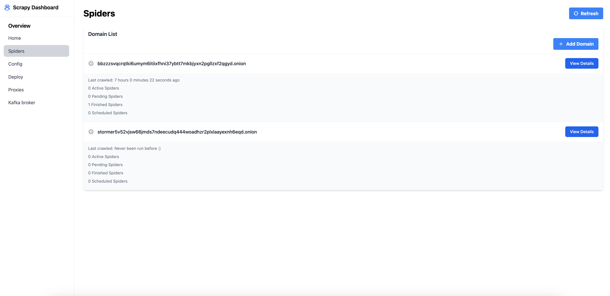

# Monitoring And Management Spider General Engine 🖥️

## User Interface Spider

Bagian ini menunjukkan antarmuka pengguna (User Interface) untuk memantau dan mengelola spider yang sedang berjalan atau terjadwal.

Tampilan antarmuka utama yang mencakup daftar spider, statusnya, dan opsi pengelolaan seperti menjalankan, menghentikan, atau menjadwalkan spider.

## Running Now Spider Details

Bagian ini menampilkan detail spider yang sedang berjalan secara real-time. Video yang disematkan memberikan panduan visual untuk memahami informasi berikut:

- Status spider yang sedang berjalan.
- Statistik seperti jumlah halaman yang sudah di-scrape, error yang ditemukan, dan waktu eksekusi.
- Fitur penghentian atau penyesuaian langsung pada spider yang aktif.

## Scheduled Spider Details

Bagian ini menampilkan detail spider yang telah dijadwalkan untuk berjalan pada waktu tertentu. Video yang disematkan memberikan panduan visual untuk memahami fitur berikut:

- Daftar spider yang dijadwalkan beserta waktu eksekusinya.
- Kemampuan untuk mengedit jadwal, menunda, atau menghapus spider dari daftar jadwal.
- Informasi status seperti "pending" atau "queued."

!> **Penting:** Saat ini `1 Browser TOR` dan `1 Reverse Tor Privoxy`, karena Spider tidak mendukung SOCKS5 secara langsung dan membutuhkan reverse proxy untuk digunakan.

