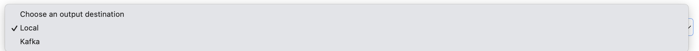

# How To Run Spider General Engine 🚀

## User Interface Deploy Spider 


--- 

## How it Works 

**Simple flow of scrapping process**


--- 

# Deploy New Spider

Antarmuka ini digunakan untuk melakukan deploy spider dalam sebuah aplikasi scraping. Berikut adalah penjelasan untuk setiap elemen pada halaman ini:


--- 

## Select Website Domain
Dropdown ini digunakan untuk memilih domain website yang akan menjadi target scraping. Pilih salah satu domain yang telah terdaftar sebelumnya.

**Ilustrasi**


---

## Select Configuration
Dropdown ini digunakan untuk memilih konfigurasi yang akan digunakan untuk spider. Konfigurasi mencakup pengaturan seperti XPath, header, cookie, dan pengaturan lainnya.

**Ilustrasi**


---

## Select Proxies
Bagian ini digunakan untuk menentukan proxy yang akan digunakan selama proses scraping. Proxy membantu menyembunyikan identitas IP asli dan mencegah pemblokiran.

### Proxies Available

**Ilustrasi**


!> **Penting:** Proxy ini mencakup `1 Browser TOR` dan `1 Reverse Tor Privoxy`, karena Spider tidak mendukung SOCKS5 secara langsung dan membutuhkan reverse proxy untuk digunakan.

- Jika tidak ada proxy yang tersedia, akan muncul pesan:  
  _"No proxies available at the moment. Please check the **proxy status page** for available proxy information."_

--- 

### Proxies No Available

**Ilustrasi**


#### Add Rotating Proxies

!> **Penting:** Jika `Rotating Tor Proxy` tidak tersedia/kosong kunjung tab `Proxies` untuk menambahkan `Rotating Tor Proxy`.

**Ilustrasi**


---

## Cookie JSON (Optional)
Di sini, pengguna dapat menambahkan cookie dalam format JSON untuk dikirim bersama permintaan HTTP.

Contoh format JSON:
```json
{
  "cookie_1": "value_1",
  "cookie_2": "value_2",
  "cookie_3": "value_3",
  "cookie_4": "value_4"
}
```
--- 

## Output Destination
Dropdown ini digunakan untuk memilih tujuan penyimpanan data hasil scraping. Beberapa opsi umum mungkin termasuk:

### Local Storage Server

**Ilustrasi**



?> **Note:** Jika memilih Output Destination `local` ini akan menyimpan result didalam `server`.

--- 

### Kafka Brokers

#### Kafka Brokers Available

**Ilustrasi**


?> **Tips:** Jika memilih Output Destination `Kafka` ini akan menyimpan result didalam `Kafka Brokers` yang sudah dikonfigurasi.

#### Kafka Brokers No Available

**Ilustrasi**


!> **Penting:** Jika `Kafka Brokers & Kafka Topics` tidak tersedia/kosong kunjung tab `Kafka Brokers` untuk menambahkan `Kafka Brokers`.

##### Add Kafka Brokers

**Ilustrasi**


?> **Note:** Gambar dibawah ini untuk menambahkan `Kafka Brokers`.

**Ilustrasi**


--- 

## Deployment Time
Pengguna dapat menentukan waktu deploy spider

### Run Now

Spider langsung dijalankan setelah deploy.

**Ilustrasi**


?> **Tips:** Untuk melihat contoh `Deployment Spider Time Now`, dapat mengunjungi [Time Now Spider](http://10.10.10.18:8443/proxy/3000#/monitoring?id=running-now-spider-details).


### Schedule Run

Spider dijadwalkan untuk dijalankan pada waktu tertentu.

**Ilustrasi**


?> **Tips:** Untuk melihat contoh `Deployment Spider Scheduled`, dapat mengunjungi [Scheduled Spider](http://10.10.10.18:8443/proxy/3000#/monitoring?id=scheduled-spider-details).

--- 

## Additional Custom Settings
Bagian ini memungkinkan pengguna untuk menambahkan pengaturan tambahan dalam format JSON. Pengaturan ini dapat mencakup:

DOWNLOAD_DELAY: Waktu jeda antar permintaan (dalam detik).
CONCURRENT_REQUESTS: Jumlah permintaan yang dijalankan secara bersamaan.
Contoh format JSON:

```json
{
  "DOWNLOAD_DELAY": 1,
  "CONCURRENT_REQUESTS": 16,
  "CONCURRENT_ITEMS" : 100,
  "CONCURRENT_REQUESTS_PER_DOMAIN" : 8
}
```

?> **Tips:** Jika ingin melihat `additional custom settings` lebih lanjut kunjungi [Scrapy Settings](https://docs.scrapy.org/en/latest/topics/settings.html).

--- 


